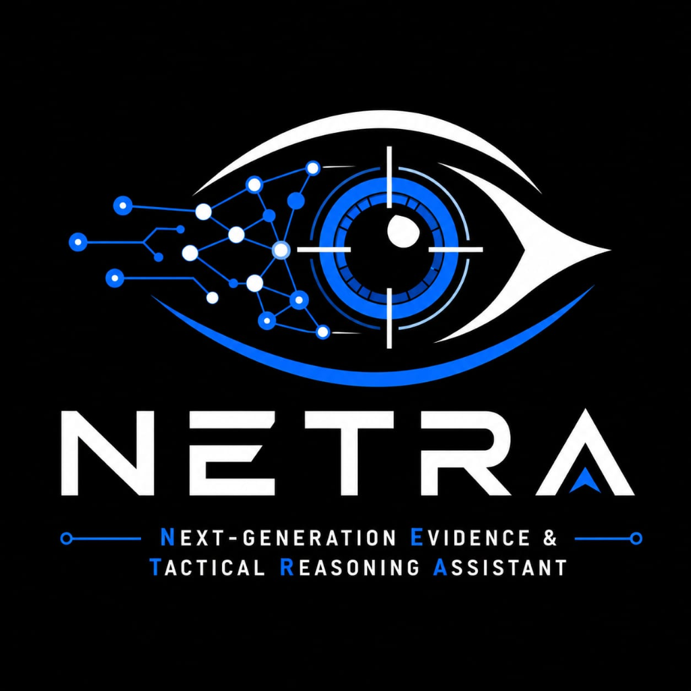
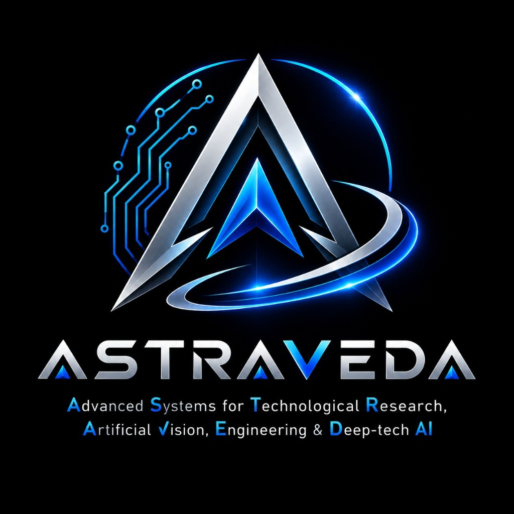

<div align="center">
  
  &nbsp;&nbsp;&nbsp;&nbsp;
  

  # NETRA // Astraveda Defence

  **Next-Generation Evidence & Tactical Reasoning Assistant**  
  *Advanced Systems for Technological Research, Artificial Vision, Engineering & Deep-tech AI*

  > **"See. Understand. Respond."**  
  > AI-powered interactive defence intelligence and situational-awareness command platform.
</div>

---

## Foundation Phase Overview

NETRA is engineered as a high-density, mission-critical command-and-control platform. This initial foundation phase establishes the monorepo architecture, Express API infrastructure, tactical React client shell, and Prisma database configuration.

### Operational Guardrails
- **Human-in-the-loop**: AI services remain purely advisory.
- **Autonomous Weapon Prohibitions**: Weapon firing, autonomous attacks, and targeting routines are strictly disallowed by system doctrine.
- **Strict Separation of Concerns**: Clean Controller → Service → Data Access layering.

---

## Monorepo Architecture

```
NETRA/
├── ai-core/                    # Python Intelligence Core (FastAPI, AI/ML, Phases 1-6) [ATUL]
│   ├── anomaly/                # Phase 4: Multi-dimensional anomaly detection & attribution
│   ├── api/                    # FastAPI endpoints (/health, /intelligence, /anomalies, /fusion, /predictions)
│   ├── entities/               # Phase 3: Entity profiles, behavioral baselines & focus mode
│   ├── events/                 # Phase 2: Multi-event correlation, clustering & deduplication
│   ├── fusion/                 # Phase 5: Multi-source sensor fusion, conflict arbitration & evidence
│   ├── intelligence/           # Master domain orchestrators (Phases 1-6)
│   ├── models/                 # Deterministic Pydantic v2 data contracts
│   ├── prediction/             # Phase 6: Predictive intelligence, trend regression & forecasting
│   ├── simulation/             # 40+ operational synthetic scenarios
│   └── tests/                  # 248 automated unit & integration tests (100% pass rate)
├── apps/
│   ├── web/                    # React 18, Vite, TypeScript, Tailwind CSS, TanStack Query [AYUSH]
│   └── api/                    # Express.js, TypeScript, Zod, Structured Logger, Correlation ID [AYUSH]
├── packages/
│   └── shared/                 # Common TypeScript contracts, API envelopes, constants
├── prisma/
│   └── schema.prisma           # PostgreSQL database schema and migration baseline
├── docs/                       # Architecture & Setup documentation
├── .env.example                # Environment variables template
└── package.json                # Root workspaces configuration
```

---

## Technology Stack

| Layer | Technologies | Primary Owner |
| :--- | :--- | :--- |
| **Intelligence Core** | Python 3.12, FastAPI, Pydantic v2, Pytest, NumPy | **ATUL** (AI/ML & Intelligence) |
| **Command Web UI** | React 18, TypeScript, Vite, Tailwind CSS, TanStack Query, Lucide React, Recharts, Framer Motion | **AYUSH** (Full Stack) |
| **Command API Gateway** | Node.js, Express.js, TypeScript, Zod, UUID, CORS | **AYUSH** (Full Stack) |
| **Database & ORM** | PostgreSQL, Prisma ORM | Joint |
| **Architecture** | Hybrid Monorepo (Node.js workspaces + Python AI Core) | Joint |

---

## Quick Start

### 1. NETRA Intelligence Core (Python / AI / ML)
```bash
cd ai-core
pip install -r requirements.txt
python main.py
```
- **Intelligence API Root**: [http://localhost:8000](http://localhost:8000)
- **Interactive OpenAPI Documentation**: [http://localhost:8000/docs](http://localhost:8000/docs)
- **Verification Suite (248 Tests)**:
  ```bash
  pytest tests/
  ```

### 2. NETRA Operational Dashboard & Gateway (Node / TypeScript)
```bash
npm install
cp .env.example .env
npm run dev
```

- **Frontend Command Display**: [http://localhost:5173](http://localhost:5173)
- **Backend API Root**: [http://localhost:5000/api/v1](http://localhost:5000/api/v1)
- **Health Endpoint**: [http://localhost:5000/api/v1/health](http://localhost:5000/api/v1/health)

---

## Quality & Verification

```bash
# Verify Python Intelligence Core (248/248 tests passed, 50/50 bit-for-bit determinism)
cd ai-core && pytest tests/ -q && cd ..

# Run strict TypeScript type checks across all Node workspaces
npm run typecheck

# Run production build across all Node workspaces
npm run build
```


---

## Licensing & Compliance
Proprietary software developed by Astraveda Defence. All rights reserved.
